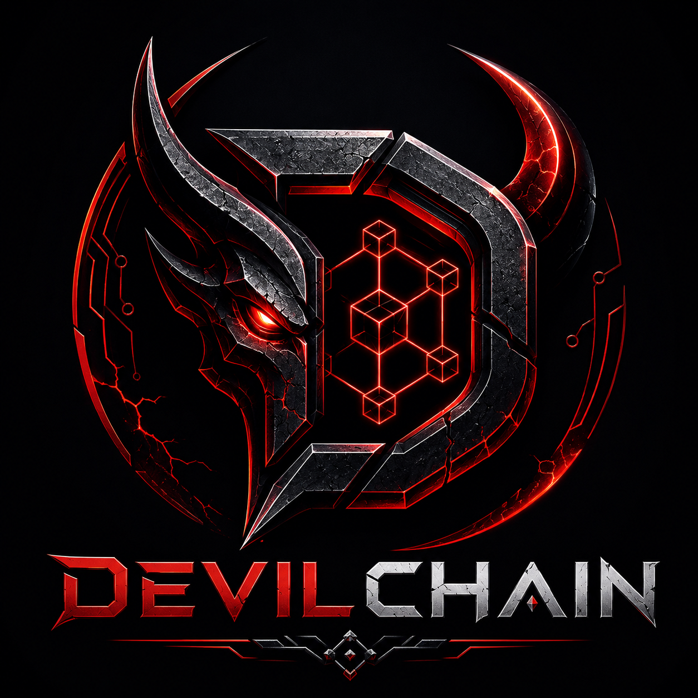

# 

<p align="center">
  
</p>

<h1 align="center">DevilChain Network</h1>

<p align="center">
  <b>Lightweight Hybrid AI-Powered DAO Blockchain Ecosystem</b><br/>
  Native Coin: <b>DevilCoin (DVC)</b> &nbsp;|&nbsp; Symbol: <b>DVL</b>
</p>

<p align="center">
  
  
  
  
  
  
</p>

<p align="center">
  <a href="https://nexuzy.tech" target="_blank">
    
  </a>
  <a href="https://devilone.in" target="_blank">
    
  </a>
</p>

---

## 👨‍💻 Developer & Credits

<table align="center">
  <tr>
    <td align="center" width="50%">
      <h3>🏢 Developed by</h3>
      <a href="https://nexuzy.tech" target="_blank">
        
      </a>
      <br/><br/>
      <b>Nexuzy Lab</b> — the innovation lab behind DevilChain.<br/>
      Building next-generation Web3, AI, and blockchain infrastructure.<br/><br/>
      <a href="https://nexuzy.tech">🌐 nexuzy.tech</a>
    </td>
    <td align="center" width="50%">
      <h3>⚡ Powered by</h3>
      <a href="https://devilone.in" target="_blank">
        
      </a>
      <br/><br/>
      <b>Devil One</b> — infrastructure & ecosystem partner.<br/>
      Driving the DevilChain ecosystem forward.<br/><br/>
      <a href="https://devilone.in">🌐 devilone.in</a>
    </td>
  </tr>
</table>

<p align="center">
  <b>Lead Developer:</b> <a href="https://github.com/david0154">David</a> &nbsp;|&nbsp;
  <a href="https://github.com/david0154">@david0154</a> on GitHub
</p>

---

## 🔥 Vision

DevilChain is a **lightweight hybrid AI-powered DAO blockchain** ecosystem designed for:

- ⚡ High-throughput Web3 applications (5,000–20,000 TPS)
- 📱 Decentralized social media & encrypted messaging
- 🤖 AI-assisted blockchain infrastructure & security
- 💻 Low-cost validator nodes & accessible VPS mining
- 🌉 Seamless cross-chain compatibility (ETH, BNB, Polygon, Solana)
- 🛡️ DevilGuard AI — real-time fraud, rug pull & spam detection
- 🪪 DevilID — decentralized Web3 identity (DID:devil)

---

## 🌐 Core Ecosystem

| Product | Purpose | Status |
|---|---|---|
| DevilChain Core | Main Layer-1 blockchain (Rust) | ✅ Active |
| DevilCoin (DVC/DVL) | Native gas & staking coin | ✅ Active |
| DevilX Wallet | Multi-platform Web3 wallet (Flutter) | ✅ Active |
| DevilScan | Blockchain explorer (Next.js) | ✅ Active |
| DevilProtocol | Smart contract system (EVM+WASM) | ✅ Active |
| DevilChain DAO | On-chain governance | ✅ Active |
| DevilSocial | Decentralized Web3 social media (Next.js) | ✅ Active |
| DevilChat | E2E encrypted wallet-to-wallet messaging | ✅ Active |
| DevilGuard AI | AI security, fraud & spam detection | ✅ Active |
| DevilBridge | Cross-chain bridge (ETH/BSC/Polygon/SOL) | ✅ Active |
| DevilStorage | Decentralized file storage (CID-based) | ✅ Active |
| DevilID | Decentralized identity (DID:devil) | ✅ Active |
| DevilAI Node | AI validator & miner system | ✅ Active |

---

## 🏗️ Architecture

**Type:** Hybrid Layer-1 Blockchain
**Consensus:** Devil Hybrid Protocol (DHP)

| Layer | Component |
|---|---|
| Security | Proof of Stake (primary) |
| Anti-Spam | Micro Proof of Work |
| Governance | DAO Voting |
| Optimization | AI Scoring & Auto-healing |

### Consensus Flow

```
User Transaction
       ↓
Mempool Validation
       ↓
DevilGuard AI Risk Scan
       ↓
Validator Selection (PoS)
       ↓
Micro PoW Puzzle Check
       ↓
Block Creation + Merkle Root
       ↓
DAO Verification Signature
       ↓
Final Block Confirmation
```

---

## ⚙️ Tech Stack

| Layer | Technology |
|---|---|
| Core Language | Rust |
| Secondary Services | Python, Golang |
| Smart Contracts | Solidity + WASM |
| VM Engine | Modified EVM |
| Database | RocksDB |
| Networking | libp2p |
| APIs | REST (port 8545) + GraphQL (port 8546) |
| AI Runtime | ONNX Runtime / TinyML |
| Explorer | Next.js 14 + Tailwind CSS |
| Mobile Wallet | Flutter 3 |
| Social / Chat | Next.js 14 |
| Bridge Relayer | Python FastAPI |
| Storage | CID-based (IPFS-compatible) |

---

## 🖥️ Node Types

| Node Type | Min CPU | Min RAM | Min Disk | Min Stake | Port |
|---|---|---|---|---|---|
| Lite Node | 2 Core | 2 GB | 25 GB SSD | None | 30303 |
| Validator Node | 4 Core | 8 GB | 100 GB SSD | 100 DVC | 30303 |
| AI Node | 4 Core | 8 GB | 100 GB SSD | 100 DVC | 8547 |
| Archive Node | 8 Core | 16 GB | 1 TB SSD | None | 30303 |
| Storage Node | 2 Core | 4 GB | 500 GB HDD | None | 8548 |

---

## ⛏️ Mining

**Engine:** DevilMine &nbsp;|&nbsp; **Algorithm:** `DVLHash-AI`

- ✅ CPU-optimized & accessible
- ✅ Anti-ASIC & Anti-GPU domination
- ✅ Dynamic difficulty adjustment
- ✅ AI-assisted optimization (+bonus DVC per block)
- ✅ Block Reward: **50 DVC** per block + AI bonus

---

## 💰 Tokenomics — DevilCoin (DVC/DVL)

| Allocation | % | Amount | Wallet |
|---|---|---|---|
| Mining Rewards | 35% | 350,000,000 DVC | `db1xmining_pool` |
| Ecosystem Growth | 20% | 200,000,000 DVC | `db1xecosystem` |
| DAO Treasury | 15% | 150,000,000 DVC | `db1xdao_treasury` |
| Team & Development | 10% | 100,000,000 DVC | `db1xteam` |
| Validators | 10% | 100,000,000 DVC | `db1xvalidator_pool` |
| Investors | 5% | 50,000,000 DVC | `db1xinvestors` |
| Community Rewards | 5% | 50,000,000 DVC | `db1xcommunity` |

**Total Supply:** 1,000,000,000 DVC &nbsp;|&nbsp; **Decimals:** 18 &nbsp;|&nbsp; **Symbol:** DVC / DVL

---

## 🎯 Network Performance

| Metric | Target |
|---|---|
| TPS | 5,000 – 20,000 |
| Block Time | 2 – 5 seconds |
| Finality | < 10 seconds |
| Gas Fee | < 0.01 DVC |
| Energy Usage | Very Low (PoS dominant) |

---

## 🚀 Quick Start

### Docker (Recommended)
```bash
git clone https://github.com/david0154/DevilChain.git
cd DevilChain
bash docker/start.sh all
```

### Service Map after start:
| Service | URL |
|---|---|
| DevilChain Node REST | http://localhost:8545 |
| GraphQL API | http://localhost:8546/graphql |
| DevilGuard AI | http://localhost:8547 |
| DevilStorage | http://localhost:8548 |
| DevilBridge | http://localhost:8549 |
| DevilScan Explorer | http://localhost:3000 |
| DevilSocial | http://localhost:3001 |
| DevilChat | http://localhost:3002 |

### Run Tests
```bash
bash docker/start.sh test
bash docker/quick_test.sh
```

### Generate Test Wallets
```bash
python docker/tests/generate_wallets.py --count 3 --export
```

### Generate & Check Coins
```bash
python docker/tests/generate_coin.py --mint --export
```

---

## 📁 Repository Structure

```
DevilChain/
├── core/              # Rust blockchain core
├── wallet/            # DevilX Wallet (Flutter)
├── explorer/          # DevilScan Explorer (Next.js 14)
├── contracts/         # Smart contracts (Solidity)
├── ai/                # DevilGuard AI (Python FastAPI)
├── storage/           # DevilStorage Node (Rust)
├── identity/          # DevilID (DID:devil)
├── social/            # DevilSocial (Next.js 14)
├── chat/              # DevilChat (Next.js 14)
├── bridge/            # DevilBridge (Python FastAPI)
├── sdk/               # SDKs (JS, Kotlin, Swift, Rust, Python)
├── docker/            # Docker Compose + test suite
├── docs/              # API.md, TESTING.md, DOCKER.md
└── README.md
```

---

## 🔌 API Reference

### REST API (port 8545)
```http
GET  /api/status
GET  /api/block/latest
GET  /api/block/{height}
GET  /api/tx/{hash}
GET  /api/wallet/{address}
GET  /api/validators
GET  /api/dao/proposals
GET  /api/coin
POST /api/send
POST /api/stake
POST /api/unstake
POST /api/vote
POST /api/faucet
```

### Bridge API (port 8549)
```http
GET  /health
GET  /chains
POST /bridge/initiate
POST /bridge/lock
GET  /bridge/status/{bridge_id}
GET  /bridge/history/{address}
GET  /stats
```

---

## 🗳️ DAO Governance

```
Voting Power = Stake Amount + Reputation Score + Validator Score
```

---

## 🗺️ Roadmap

| Phase | Deliverables | Status |
|---|---|---|
| Phase 1 | Blockchain core, Wallet, Explorer, DAO, Testnet | ✅ Complete |
| Phase 2 | Smart contracts, Staking, NFT support, Validators | ✅ Complete |
| Phase 3 | DevilGuard AI, AI Node, AI moderation | ✅ Complete |
| Phase 4 | DevilSocial, DevilChat, DevilID, DevilStorage | ✅ Complete |
| Phase 5 | DevilBridge, Mainnet launch, DevilOS | ✅ Complete |

---

## 🛡️ Security

- **Wallet Encryption:** AES-256-GCM
- **Signatures:** Ed25519
- **Key Exchange:** Curve25519
- **Recovery:** BIP39 Mnemonic
- **AI Security:** DevilGuard AI scans all TXs, contracts, and nodes
- **Anti-Sybil:** Stake-based identity + DAO approval
- **DDoS Protection:** Rate limiting + AI anomaly detection

---

## 📄 License

Copyright © 2026 **Nexuzy Lab** &amp; **Devil One**. All rights reserved.

This project is licensed under the **MIT License** — see the [LICENSE](LICENSE) file for full details.

---

<p align="center">
  <b>Built with ❤️ by</b> <a href="https://nexuzy.tech" target="_blank"><b>Nexuzy Lab</b></a>
  &nbsp;|&nbsp;
  <b>Powered by</b> <a href="https://devilone.in" target="_blank"><b>Devil One</b></a>
  &nbsp;|&nbsp;
  Lead Dev: <a href="https://github.com/david0154"><b>David @david0154</b></a>
</p>

<p align="center">
  <a href="https://nexuzy.tech">🌐 nexuzy.tech</a>
  &nbsp;&nbsp;•&nbsp;&nbsp;
  <a href="https://devilone.in">🌐 devilone.in</a>
  &nbsp;&nbsp;•&nbsp;&nbsp;
  <a href="https://github.com/david0154/DevilChain">⭐ Star on GitHub</a>
</p>
